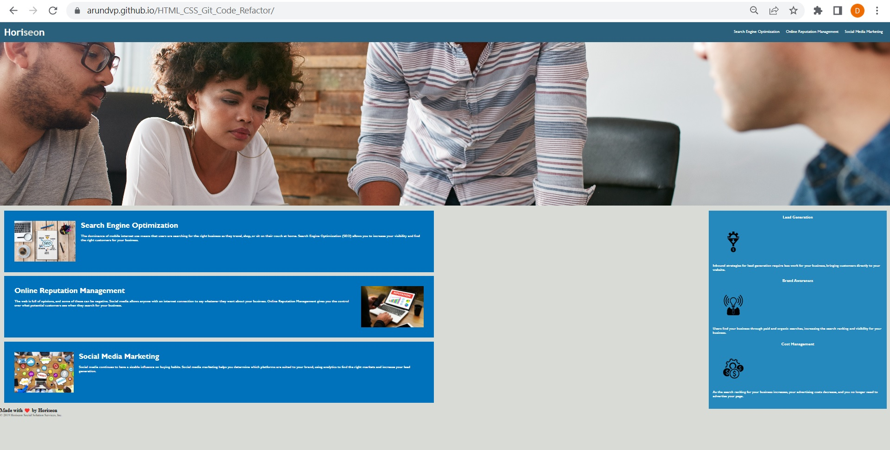

# 01 HTML, CSS, and Git: Code Refactor

# Objective:

AS A marketing agency , I WANT a codebase that follows accessibility standards, SO THAT our own site is optimized for search engines.

## Tasks Completed:

Create the GIT repository HTML_CSS_Git_Code_Refactor and cloned the code from https://github.com/coding-boot-camp/urban-octo-telegram repository

Added accessibility standards by adding the alt attributes in index.html for all images

Refactoring of the CSS code without modifying the functionalities by following the Scout Rule 

Pushed the code the repository HTML_CSS_Git_Code_Refactor

Hosted the index.html in GitHub Pages

## Links 

URL to the GitHub repository: https://github.com/arundvp/HTML_CSS_Git_Code_Refactor

URL to my deployed webpage: https://arundvp.github.io/HTML_CSS_Git_Code_Refactor/

-----
© 2023 edX Boot Camps LLC. Confidential and Proprietary. All Rights Reserved.
